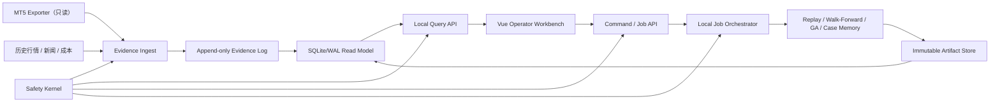

# QuantGod 全系统完善设计书

版本：1.5
日期：2026-08-01
适用目录：`QuantGodBackend`、`QuantGodFrontend`、`QuantGodInfra`、`QuantGodDocs`，以及只读兼容目录 `QuantGod`
当前决策：纯本地、纯外汇、研究与证据优先、Shadow/Paper 优先；本设计不授权真实下单、平仓、撤单、实盘参数修改或 Kill Switch 绕过。HFM 仅作为外汇 broker 保留。所有数字资产、预测市场、远端同步和公网展示路线均已退役，不再属于 active architecture 或 roadmap。

## 1. 执行摘要

QuantGod 已经具备一个外汇量化研究与交易治理系统的主要工程骨架：MT5 证据采集、USDJPY 策略研究、Strategy JSON、回测、Walk-Forward、GA、Case Memory、Telegram 推送、Vue 工作台、四仓协作和本地自动化都已存在。USDJPY 是当前主交易对；其他外汇品种可以作为未来研究对象，但必须经过相同的数据质量、回测、parity 与安全门禁。

当前系统仍不能称为“生产就绪”，也不能用“Perfect Edition”表示收益有保证。核心问题不是缺少页面或策略，而是以下四条状态线被混在一起：

1. 服务进程是否还活着。
2. 数据是否足够新鲜、完整且来自同一代。
3. 策略是否有足够样本证明正期望。
4. 某个动作是否被安全策略明确允许。

最新本地审计事实为：HFM 主账号已经由 MT5 终端授权，USDJPY EA dashboard writer 正常刷新，Backend 只读桥同时确认终端进程、EA 内嵌时间和 timer heartbeat；`/api/mt5-readonly/snapshot` 为新鲜状态，当前 0 持仓、0 挂单。运行时硬边界为 `tradeStatus=SHADOW`、`shadowMode=true`、`readOnlyMode=true`、`executionEnabled=false`、`tradeAllowed=false`、DLL 禁用。本状态表示“账号已连接且可只读复核”，不表示允许真实执行。

第二账号是可选扩展车道。其已有本地凭据在安全只读启动验证中被 broker 判定为无效，因此已停止对应终端并设为默认禁用；前端和 Backend 都不再把一个未启用的可选账号汇总成主账号“不可用”。此前发现的历史数据断档已在本轮通过 MQL5 CopyRates CSV 增量入库恢复到 2026-07-31 收盘，SQLite 已启用 WAL 且 `quick_check=ok`。但历史新闻仍缺失、GA 无 elite、主策略为负期望、生产证据仍为 `FAIL`，因此研究与晋级状态继续保持 `BLOCKED`，不会因 MT5 登录或行情恢复而自动变绿。

系统不存在外部上传链路或公网入口。Backend、Frontend、MT5 证据、研究作业、运行状态和操作界面全部限定在本机 loopback、Unix socket 或本地文件边界内。

### 1.1 2026-08-01 P0 修复批次

本轮修复把设计中的首批安全与可靠性要求落到了活动代码和本地运行数据：

- 新增 `/healthz`、`/readyz` 与 `/api/operator/overview`，分别表达进程存活、完整运营就绪和统一运营快照。
- MT5 状态拆为 writer、broker、account authorization、quote freshness、market session 与 trading readiness；周末返回 `MARKET_CLOSED`，快照新鲜不再等价于 broker connected。
- 自动化证据新增 `cycleId`、`runStatus`、heartbeat、last success、next due、步骤计数和输入输出 fingerprint；未运行固定为 `NOT_STARTED`，旧成功报告自动转为 `STALE`。
- Automation 与历史报告改为临时文件、flush/fsync、atomic rename；关键任务不再使用 `command || echo` 吞掉失败。
- USDJPY 历史 SQLite 与 MT5 Platform SQLite 启用 WAL、busy timeout、foreign keys 与 online backup。
- 活动历史库从 2026-06-05 恢复到 2026-07-31 收盘；M1/M5/M15/H1/H4 均通过增量导入，研究质量仍因历史新闻缺失保持 `BLOCKED`。
- GA 在历史数据不就绪，或达到无 elite 代数上限时停止继续增加代数，要求新数据或新策略假设后才能恢复。
- 所有活动安全合同统一为 `SHADOW_READONLY`、`executionLaneExists=false`、`liveExpansionAllowed=false`、`unattendedLiveExpansionAllowed=false`、`operatorApprovalRequired=true`。
- 建立本地原子备份与校验工具；首次活动备份已通过 SQLite `quick_check` 和 SHA-256 校验。该备份仍位于同一物理磁盘，不能替代第二故障域。

本批次没有创建真实执行 lane，没有下单、平仓、撤单、改仓或放宽 Kill Switch。

本设计的目标不是继续堆功能，而是把系统改造成：

- 状态可信：未知、过期、合同不匹配时绝不显示成功。
- 动作可控：查询与命令彻底分离，长任务有作业状态、幂等和审计。
- 证据可复现：每个结论绑定数据时刻、schema、四仓版本和 artifact hash。
- 默认安全：本地安装不会自动接触 live lane，任何执行能力保持关闭。
- 可恢复：运行证据、SQLite 和发布产物有备份、校验与回滚。
- 可维护：减少超大模块、重复请求、脚本式工作流和跨仓隐式依赖。

## 2. 审计范围与方法

本次以桌面本地目录为事实源，没有以 GitHub 内容替代本地代码，也没有提交或推送。

检查范围包括：

- 四个拆分仓库和旧 `QuantGod` 目录的文件、Git 状态及重复关系。
- Backend、Frontend、launchd、screen、MT5 相关进程和端口。
- 本地 `127.0.0.1:8080`、`127.0.0.1:5173` API 与工作台页面。
- Backend Python/Node 测试、Frontend 单元测试与构建、Infra 测试、Docs 质量门和 API contract。
- 运行证据、历史数据新鲜度、GA/晋级门、自动化健康状态和 MT5 控制锁。
- 启动脚本、秘密文件权限和本地发布链。

2026-08-01 范围收敛决定：所有非外汇代码、页面、接口、文档、运行证据以及远端同步和公网展示基础设施均已移出 active 范围。HFM 的外汇账户、外汇 symbol 和 MT5 启动配置继续保留。

没有执行以下操作：

- 在检查 `AllowLiveTrading=0`、DLL 禁用、Shadow 与 ReadOnly preset 后，本地启动并验证了主 MT5/EA；无效的可选第二账号终端已停止。
- 没有下单、平仓、撤单、改单、修改持仓或启用 live execution；所有 MT5 操作都停留在登录、只读快照和 Shadow 证据验证范围。
- 没有发送 Telegram 测试消息。
- 除用户已授权并登录的 HFM MT5 broker 会话外，没有连接、调用或写入其他外部服务，也没有上传本地代码或证据。
- 没有删除旧 `QuantGod` 兼容仓库；退役模块与旧运行证据被移出 active tree 并保存在桌面权限收紧的归档目录中。

## 3. 当前系统基线

### 3.1 仓库与运行状态

| 项目 | 审计观察 | 判定 |
|---|---|---|
| Backend | Node API 在 `127.0.0.1:8080` 运行；核心 profile 已由 launchd 管理 | 服务在线，MT5 只读端点已独立验证 freshness |
| Frontend | Vite 在 `127.0.0.1:5173` 运行；生产 `dist` 已原子同步到 Backend | 5173 与 8080 使用同代源码产物 |
| MT5/EA | HFM 主账号已连接；0 持仓、0 挂单；EA 为 Shadow + ReadOnly | 当前只读状态可信；真实执行明确关闭 |
| 第二账号 | 可选车道默认禁用；旧登录验证为无效账号且终端已停止 | 不参与主账号健康汇总，不产生假阻断 |
| Agent | 可选 agent profile 未加载 | 核心本地运行不依赖可选 agent |
| MT5 核心快照 | 文件时间、EA 内嵌时间与 heartbeat 三项共同校验，TTL 180 秒 | `FRESH`；复制或 touch 旧 JSON 不能伪造新鲜状态 |
| 历史数据 | SQLite 已增量恢复到 2026-07-31；约 456 天，M1/M5/M15/H1/H4 生产状态通过 | 数据断档已修复；长期策略证据仍应扩展到至少 5 年 |
| History Sync | 一次性安全同步已成功；持续 launchd profile 纳入本轮 local-shadow 配置 | 同步失败返回非零，状态与 MT5 登录分线表达 |
| GA | 活动 runtime 约 generation 985、elite 0；仓库旧 runtime 仍显示不同代数 | 已禁止旧 runtime 静默冒充活动真相，并在无 elite 上限处冻结推进 |
| Promotion Gate | 16 blockers，9 个恢复项 | `BLOCKED` |
| MT5 控制面 | Shadow、ReadOnly、DLL 与 live execution 硬门关闭 | 当前执行面锁定，这是正确状态 |
| Frontend artifact | 最新 Vite `dist` 经 SHA-256 manifest 验证后原子发布到 `Dashboard/vue-dist` | 生产页面漂移已消除，上一版可回滚 |

### 3.2 代码与接口规模

| 范围 | 规模与特征 |
|---|---|
| Backend | 约 20.4 万行；574 个 Python 文件；主 EA 超过 1 万行 |
| Frontend | 约 5.1 万行；多个 view-model/组件超过 3000 行 |
| Infra | 本质是本地进程、端口、launchd、容器和发布编排 |
| Docs | 约 1.59 万行、127 个 Markdown 文档 |
| API | 383 个端点，其中约 118 个具有写入或命令语义 |
| Runtime | 约 1.5 GB、5586 个文件，大量证据和日志默认可被本机其他用户读取 |

### 3.3 当前策略证据

审计到的真实证据不支持扩大 live 风险：

- 当前主 USDJPY 回测约 359 笔，累计约 `netR=-164R`，Profit Factor 约 `0.37`。
- Cent 探索证据约 35 笔，累计约 `netR=-46.79R`，Profit Factor 约 `0.77`。
- 最大连续亏损证据至少为 6。
- USD deployment evidence 为 0。
- 活动 GA 已运行数百代仍没有 elite；继续增加代数不能替代新数据、新假设和独立 OOS 证据。

因此，当前正确动作是修复证据链、数据新鲜度和安全控制，而不是开启或放宽真实执行。

### 3.4 “已登录却显示账号不可用”的根因与修复

这次故障不是一个单点，而是六个状态判断叠加：

1. 为清除退役服务的本地密钥，旧 Backend/Frontend 进程曾被安全停止；MT5 登录本身不能替代 EA dashboard writer。
2. EA 启动后先经历约三分钟 warm-up；此期间只有 heartbeat，完整 dashboard 尚未生成。
3. macOS Wine 的 `ps comm` 会截断含空格的 Windows 路径，旧正则无法识别 `terminal64.exe`，导致后端把正在运行的终端误判为不存在。
4. 一个陈旧且授权无效的第二账号被当作必需车道，前端用它把整个页面汇总成阻断。
5. 旧 freshness 只看文件 mtime，复制或 touch 一份旧 JSON 会暂时产生“假新鲜”。
6. 旧部署流程会把仓库中的 synthetic Login/Server 模板复制到私有 runtime config，覆盖已经登录的 HFM 身份；终端可以启动，但无法完成 broker authorization。

已落地修复：

- 终端检测同时解析 Wine 进程并用 `lsof cwd` 将实例映射到正确 prefix，排除 wrapper/helper 误报。
- freshness 取文件 mtime、dashboard 内嵌时间、heartbeat 文件 mtime 与 heartbeat `localTime` 中最旧的一项；任一关键证据过期就 fail closed。
- `/api/latest` 与 MT5 bridge 统一使用 180 秒阈值。
- 第二账号改为显式 optional/default-disabled；其端点返回中性 `DISABLED` 合同，前端从阻断、指标、持仓、恢复矩阵和 endpoint health 中排除。
- 启动前从已登录 portable terminal 的 `common.ini`（或成对提供的本机私有变量）原子 hydration 私有 Shadow config；仓库模板继续保持 synthetic，不保存 Password，私有配置权限为 `0600`。
- launchd 在启动 Wine 前严格验证 HFM server，并把 runtime Login 与独立 LoginOnly 私有参考做常量时间比较；任何缺失、重复、大小写漂移或 synthetic 身份都 fail closed，状态和日志不泄露账号。
- 前端明确区分“主账号已连接（Shadow / ReadOnly）”与“EA 可真实执行”，不再把刻意关闭执行显示为“等待 EA 权限”。
- 增加旧 JSON 被 touch、旧 heartbeat、macOS Wine 路径、可选账号禁用和前端只读文案的自动化回归。

## 4. 已有优势

需要保留并加强的能力包括：

- 本地端口默认绑定 loopback。
- 当前环境变量将 order send、close、cancel、live preset mutation、Telegram command、Webhook 和 Kill Switch override 设为关闭。
- MT5 控制状态能报告 dry-run、Kill Switch 和 owner mode。
- Strategy JSON、GA、Walk-Forward、Parity、Case Memory 和 Evidence OS 已形成较完整研究链。
- 系统已收敛到外汇路线；不再维护钱包、交易所、预测市场、跟单或数字资产 CFD 能力。
- Telegram 被定义为 push-only，而不是命令入口。
- 四仓边界、Docs contract 和大量安全测试已经存在。
- Backend、Frontend、Infra、Docs 的现有测试主体可以通过。

这些控制不应因重构而退化。

## 5. 缺陷分级与整改要求

### 5.1 分级标准

- `P0`：可能导致真实执行越权、敏感数据泄露、错误绿色状态推动危险决策，或默认启动不安全能力。
- `P1`：导致证据不可信、命令不可追踪、系统不可恢复或跨仓发布不可复现。
- `P2`：明显降低维护性、性能、可测试性或供应链质量。
- `P3`：一致性、体验和技术债问题。

### 5.2 P0 缺陷

| ID | 缺陷 | 证据 | 影响 | 必须达到的结果 |
|---|---|---|---|---|
| QG-P0-01 | macOS 启动脚本曾存在 live 默认值 | 已改为 `MT5_START_MODE=shadow`、`MT5_LIVE_LAUNCH_ALLOWED=0`，并有负向回归 | 新环境或变量缺失时可能越过“默认关闭”原则 | **已修复并守护**；live 只能由未来独立、双重授权的执行系统开启 |
| QG-P0-02 | Python MT5 bridge 具备替代执行通道且约束不完整 | 当前环境所有 send/close/cancel/preset mutation 均关闭，页面只调用 readonly bridge | 一旦未来错误解除环境锁，仍可能形成旁路 | **当前隔离，架构整改未结束**；未来执行必须单独 RFC、进程身份和端到端负向测试 |
| QG-P0-03 | 系统曾存在“假绿/假红” | MT5 进程误判、只看 mtime、可选账号连带阻断已修复；历史/GA/晋级仍分线显示 | 操作者可能把“进程活着”误解为“策略可运行/可晋级”，或把可选车道误解为主账号失败 | **MT5 当前状态线已修复**；其余汇总继续采用最坏项，`UNKNOWN/STALE/BLOCKED` 不得产生业务绿色 |
| QG-P0-04 | 前端命令失败仍可显示成功 | API client 把失败包装为普通对象，多处组件在 `await` 后无条件成功 | 用户误以为构建、GA、自动化已完成，实际可能失败或仍在后台写入 | 命令必须严格检查 transport/domain/schema；失败不可进入成功路径 |

### 5.3 P1 缺陷

| ID | 缺陷 | 影响 | 设计修复 |
|---|---|---|---|
| QG-P1-01 | Readiness artifact 没有可靠 TTL/provenance | 旧的 `READY_FOR_EXECUTION_REVIEW` 会长期存在 | 所有证据包含 `observedAt/dataAsOf/expiresAt/sourceVersions`，过期自动 `STALE` |
| QG-P1-02 | `qg-workspace verify` 在 promotion blocked 时仍退出 0 | 结构完整性被误当成发布就绪 | 拆分 `verify-integrity` 与 `verify-release`；后者 fail closed |
| QG-P1-03 | 383 个 API 中查询、写文件、长任务和控制命令混用 | GET 可有副作用，CSRF/重放/预取边界不可靠 | GET 纯读；命令统一 POST job；schema、权限和幂等键必填 |
| QG-P1-04 | 本地 API 只有自定义 header 级保护 | 页面被 frame、恶意本地网页或重放时保护不足 | 校验 loopback、Host、Origin、session nonce；CSP、DENY frame、nosniff、速率限制 |
| QG-P1-05 | GA/Automation 自动化由前端顺序执行几十个步骤 | 部分成功后留下跨代、半完成证据 | 工作流下沉为 Backend state machine，原子提交 artifact manifest |
| QG-P1-06 | 首屏一次发出约 55–59 个请求 | 争用、延迟、跨 generation 混合 | Workspace snapshot 聚合端点、共享缓存和 snapshot ID；首屏不超过 10 请求 |
| QG-P1-07 | 风险页在字段缺失时使用合成默认值 | 空响应会显示最大仓位、策略路线和“通过” | 仅明确 `=== true` 可 PASS；缺失值显示“不可用”，禁止交易参数默认填空 |
| QG-P1-08 | launchd 安装自动启动所有可选服务 | 安装基础服务同时接触 MT5 runtime、AI、Telegram | profile 化且显式 opt-in；默认只启动本地只读 Backend/Frontend |
| QG-P1-09 | 所有 launchd 服务加载全部秘密文件 | 不必要的服务获得 Telegram/AI/账户环境变量 | 每服务 `env -i` + allowlist；Keychain 或独立 `0600` secret 文件 |
| QG-P1-10 | Telegram ledger 保存完整 API response | 本地日志暴露 chat/channel/message metadata，异常还可能携带 token URL | 只保存 message ID、状态和脱敏错误码；token 不进入 argv、URL 或异常文本 |
| QG-P1-11 | 四仓没有精确版本锁 | 同一版本可能由不同 commit 与 dist 组合构成 | 签名的 `quantgod.release-lock.json` 记录四仓 SHA、schema、artifact hash |
| QG-P1-12 | 无正式备份、恢复和演练 | SQLite/runtime 覆盖或本地卷删除后无法证明恢复 | SQLite 在线备份、WAL/checksum、本地加密副本、RPO/RTO 和自动 restore test |
| QG-P1-13 | 旧 `QuantGod` 与 Backend 双份目录并存 | 人员或脚本可能从旧目录启动，造成证据分叉 | 不删除；标记只读兼容，启动脚本只接受 release lock 指定的 canonical path |

### 5.4 P2/P3 缺陷

- Backend 单文件 EA、Dashboard server 和大量 Python 模块过大，Ruff 当前有数千条告警。
- Frontend 多个组件和 model 超过 3000 行，命令、请求编排、风险推导和文案混在一起。
- Frontend 构建有循环 chunk，Monaco 和 Ant Design Vue 产物过大。
- Frontend 依赖审计存在 high 级告警，生产依赖仍有 PostCSS 告警。
- API contract 只描述 method/path 等有限字段，没有 request/response/error schema。
- Backend route registry 将写入属性硬编码成只读，安全元数据不可信。
- Docker 缺少非 root、只读根文件系统、cap drop、日志/资源上限和 digest pin。
- GitHub Actions、依赖、镜像和 secret scan 没有完整供应链门禁。
- Frontend `dist` 同步先删除旧目录再复制，失败时可能没有可用页面。
- Backend 打包页面与 Vite 页面没有 artifact drift 检查。
- Docs 版本说明同时出现 v2.6、v2.7、v2.8，但没有一个统一发布版本。
- `.env.local`、Telegram secret、runtime 与日志权限过宽。

## 6. 根因分析

### 6.1 “状态”没有统一语义

代码中同时使用 `ok`、`PASS`、`WARN`、`READY`、`healthy`、`blocked` 等字段，却没有统一规定：

- 是进程状态还是业务状态。
- 是文件存在还是数据新鲜。
- 是可以研究还是可以晋级。
- 是 HTTP 成功还是命令成功。

结果是局部检查通过后被汇总成全局绿色。

### 6.2 查询面、命令面和执行面没有彻底隔离

Backend 的 `/api/*` 同时承担静态数据、文件生成、长时间 Python 作业和交易控制。Frontend 也同时承担展示与流程编排。边界越混合，权限、超时、重试、幂等和审计越难保证。

### 6.3 运行证据以松散文件为中心

大量 JSON/CSV 是有价值的审计材料，但缺少共同 transaction/generation、schema、TTL 和 content hash。页面在不同时间读取几十个文件后，无法证明它们属于同一轮系统状态。

### 6.4 自动化以“进程存在/退出码 0”为健康标准

launchd、screen 和一次性任务可以显示正常，但上游 MT5 已停、数据已经过期。基础设施没有把“最后成功产出时间”作为第一等指标。

### 6.5 功能增长快于契约与发布工程

策略、GA、证据页面增长很快，但 OpenAPI、跨仓版本锁、作业系统、备份恢复和前端模块化没有同步成熟。

## 7. 目标架构

目标“生产”只指生产级本地外汇只读监控、研究与证据平台。当前设计中不存在可用的 live execution lane，也不存在钱包、交易所、预测市场、外部上传或公网访问边界。



### 7.1 核心边界

1. `Evidence Ingest` 只接收 schema 合法、带来源和时间的证据。
2. `Query API` 纯读、快速、可缓存，不启动 Python 子进程。
3. `Command / Job API` 只创建本地研究作业，返回 operation ID。
4. `Safety Kernel` 是独立、不可由普通 env 覆盖的最终判定层。
5. `Artifact Store` 使用不可变 generation 目录和 manifest，不覆盖“当前”文件后再补元数据。
6. 所有服务默认禁止外部上传；任何研究证据、账户数据、日志和 artifact 都不得离开本机边界。
7. 所有操作界面只通过 loopback 或 Unix socket 访问，不提供公网监听、隧道、边缘代理或第三方展示入口。
8. 任何未来真实执行都必须是另一个系统边界、独立进程身份和单独安全评审，不复用研究 Job API。

## 8. 统一证据与状态合同

### 8.1 Evidence Envelope

每个可展示、可晋级或可用于自动化的结果都必须使用统一 envelope：

```json
{
  "schema": "quantgod.evidence.v1",
  "kind": "history-production",
  "status": "STALE",
  "reasonCodes": ["M1_TOO_OLD", "SYNC_HEARTBEAT_MISSING"],
  "observedAt": "2026-08-01T12:00:00Z",
  "dataAsOf": "2026-06-05T00:00:00Z",
  "expiresAt": "2026-08-01T12:05:00Z",
  "snapshotId": "sha256:...",
  "sourceVersions": {
    "backend": "git-sha",
    "frontend": "git-sha",
    "infra": "git-sha",
    "docsContract": "sha256:..."
  },
  "payload": {},
  "contentHash": "sha256:..."
}
```

### 8.2 唯一状态枚举

| 状态 | 含义 | UI | 可晋级 |
|---|---|---|---|
| `HEALTHY` | schema、来源、时间和全部硬门均明确通过 | 绿色 | 仍需策略证据门 |
| `DEGRADED` | 可继续观察，但有非关键降级 | 黄色 | 否，直到规则明确允许 |
| `BLOCKED` | 已知硬门失败 | 红色 | 否 |
| `UNKNOWN` | 缺失、解析失败、版本不认识或无法验证 | 灰色/红色 | 否 |
| `STALE` | 超过 TTL | 灰色/红色 | 否 |

总体状态采用最坏项，不允许通过“忽略缺失字段”变绿。

### 8.3 四条状态线

工作台必须分别显示：

1. `Service Health`：进程、端口、资源和 last heartbeat。
2. `Data Health`：行情、runtime、news、fastlane 的 data age 和质量。
3. `Research Readiness`：回测、parity、sample size、GA、walk-forward 和 promotion gate。
4. `Execution Permission`：当前必须固定为 `DISABLED`，不能由前三项自动推导为开启。

“服务健康”绝不能覆盖“数据过期”，`READY_FOR_REVIEW` 也绝不能显示成“可执行”。

## 9. API 与作业模型

### 9.1 API 分类

| 类型 | 方法 | 特征 |
|---|---|---|
| 查询 | GET | 纯读、无文件写入、无子进程、可设置 ETag |
| 创建作业 | POST | `202 Accepted`、幂等键、operation ID |
| 查询作业 | GET | 返回阶段、进度、错误和 artifact manifest |
| 取消研究作业 | POST | 只取消可取消的本地研究任务，记录审计事件 |
| 管理配置 | PUT/PATCH | 版本条件、schema、操作 nonce；当前不得包含 live preset |

必须移除或迁移所有具有副作用的 GET，例如 backtest run 和带 `write=1/refresh=1` 的查询。

### 9.2 Command Result

```json
{
  "ok": false,
  "operationId": "op_...",
  "status": "FAILED",
  "error": {
    "code": "HISTORY_STALE",
    "message": "历史数据已过期，未启动 GA 作业",
    "retryable": false
  },
  "requestId": "req_..."
}
```

Frontend 只在 HTTP、JSON schema 和 domain `ok === true` 三者都成立时显示成功。

### 9.3 作业状态机

```text
QUEUED -> VALIDATING -> RUNNING -> COMMITTING -> SUCCEEDED
                      \-> BLOCKED
                      \-> FAILED
                      \-> CANCELLED
```

`COMMITTING` 阶段先写临时 generation，完成 schema/hash 检查后原子发布 manifest。失败时旧 generation 仍可读取。

## 10. 数据、回测与 GA 设计

### 10.1 数据层

- 原始 bars、news、spread、execution feedback 使用 append-only 导入记录。
- 每次导入记录 provider、symbol mapping、timezone、缺口、重复、异常值和校验和。
- 所有 backtest/GA 只读取不可变 dataset version。
- 当前 `runtime` 不再承担“源数据、临时文件、当前状态、日志、秘密”四种职责；拆成 `evidence/`、`artifacts/`、`state/`、`logs/`，全部位于仓库之外的 `0700` 本地数据目录。

### 10.2 研究可复现性

每次研究作业必须记录：

- dataset hash、时间范围、symbol、timeframe 和成本模型。
- strategy schema/fingerprint、参数、随机种子和代码 SHA。
- train/validation/forward 切分规则。
- Python、Node、MQL5/Tester 版本。
- 完整指标与失败原因，而不是只保存最佳 fitness。

### 10.3 晋级规则

当前不设置“达到某个 Profit Factor 就自动实盘”的捷径。晋级最多只能进入人工研究评审包，必须同时满足：

- 历史数据与 runtime 均为 `HEALTHY`，且来自同一 snapshot lineage。
- 训练、验证、forward 和扰动测试均有足够样本。
- 不同市场阶段、spread/slippage 压力和参数邻域下结果稳定。
- Strategy JSON、Python replay 与 MQL5 diagnostics parity 明确通过。
- 没有 unresolved blocker，且结果可由 release lock 重放。
- 真实执行权限仍保持关闭；未来执行需另立项目。

### 10.4 防过拟合

- Nested walk-forward，不以同一 forward 集反复选择参数。
- 保存全部候选与被淘汰原因，避免只看幸存者。
- 对策略族设置复杂度惩罚和参数稳定区间。
- 用 bootstrap/Monte Carlo 估计指标置信区间。
- 引入数据泄漏检测、未来函数检查和多重检验修正。
- GA 连续无 elite 时进入 `BLOCKED/INSUFFICIENT_EVIDENCE`，不能通过扩大 live 风险解决。

## 11. Frontend 目标设计

### 11.1 首页信息架构

页面采用“结论优先、证据渐进披露”，不再让同一个故障在恢复矩阵、端点健康、数据源和策略面板中重复出现。首屏只保留：

1. 一个运营结论 Hero：`正常观察`、`需要关注` 或 `已阻断`。
2. MT5 六轴短状态：broker、账户授权、writer、报价、市场时段、trading readiness。
3. 四个关键指标：余额、净值、持仓、挂单；证据缺失时显示“不可确认”，不得补零冒充实值。
4. 最多三个主要 blocker 和每项唯一的下一步。
5. MT5 与策略进化两个明细入口；执行权限固定显示 `Shadow / ReadOnly`。

恢复矩阵、端点健康、数据源、Profiles、RSI、Evidence OS、GA、Telegram、日报、ledger 和技术证据进入折叠分区，默认不争夺首屏注意力。表格默认只显示 5–10 行和关键列，用户明确展开后才加载完整证据。红色只用于明确阻断，过期和未知使用稳定的中性色加警示，避免整页高饱和红色造成信息疲劳。

### 11.2 数据加载

- 每个 workspace 使用一个 versioned summary endpoint。
- 首屏网络请求不超过 10 个；同一路径同一时间只允许一个 in-flight request。
- 明细按展开加载，并继承同一 snapshot ID。
- 如果 snapshot ID 不一致，页面显示“证据跨代”，不合并计算。
- 全局刷新有统一节流、取消和最后成功时间。

### 11.3 操作体验

- 命令按钮提交一次 job，不在浏览器串行运行 10–40 个步骤。
- 显示真实阶段、operation ID、开始时间、数据版本和失败原因。
- 超时不等于失败；前端断开后可重新关联 operation。
- 不使用最大仓位、live route 等合成默认值填补空响应。
- 所有危险词汇区分 `研究候选`、`评审就绪` 和 `执行许可`。
- App Shell 只保留一套标题与描述；导航使用“总览 / MT5 / 策略进化”的用户语言，技术名称降为辅助说明。
- 只有结论 Hero 使用状态色背景，其余卡片使用中性表面；正文不小于 14px，辅助文字不小于 13px，并统一 12/16/24px 间距节奏。
- 折叠标题保证至少 44px 点击高度，键盘焦点可见；表格提供 caption、列头语义和窄屏关键列视图。

## 12. 安全设计

### 12.1 本地 API

- 只监听 loopback 或 Unix domain socket。
- 启动时若配置为 `0.0.0.0`，生产模式直接拒绝。
- 命令路由校验 Host、Origin、本地 session nonce、CSRF 和短期操作 token。
- 添加 CSP `frame-ancestors 'none'`、`X-Frame-Options: DENY`、`X-Content-Type-Options: nosniff`。
- 限制并发 Python 作业、请求体、响应体和超时。
- 静态文件只能从明确的 public roots 读取，使用 `realpath` 后做严格 containment 检查。

### 12.2 秘密与本地权限

- Broker、Telegram、AI token 不写进仓库、runtime、launchd.env 或日志。
- macOS 使用 Keychain；每个服务只读取自己的 secret allowlist。
- 所有 secret 文件 `0600`，数据/日志目录 `0700`，启动时审计权限。
- Telegram 只保存脱敏 delivery metadata，不保存完整 API response。
- 当前已出现于明文环境文件的密钥应在单独维护窗口轮换；轮换不是本设计自动执行的一部分。

### 12.3 纯本地网络边界

- Backend 和 Frontend 只监听 `127.0.0.1`、`::1` 或 Unix domain socket。
- 启动配置出现非 loopback 地址、反向代理、隧道或外部上传 endpoint 时直接失败。
- MT5、研究作业与操作界面之间只交换本地文件或本地 API 数据。
- 防火墙和进程配置应阻止核心服务主动上传运行证据、账户数据、日志或 artifact。
- 当前不存在公网域名、公开 API、第三方展示页或外部数据接收端。

## 13. Infra、发布与恢复

### 13.1 Profile 化启动

建议 profile：

| Profile | 默认 | 内容 |
|---|---|---|
| `local-readonly` | 是 | Backend Query API、Frontend |
| `research-shadow` | 否 | history、replay、GA，本地明确 opt-in |
| `notifications` | 否 | Telegram push-only，独立 secret |
| `live-execution` | 不存在 | 当前版本不提供 |

### 13.2 四仓发布锁

`quantgod.release-lock.json` 至少记录：

- 四仓精确 commit SHA 和 dirty/ahead 状态。
- API/schema 版本。
- Frontend dist hash 与 Backend packaged hash。
- Python/Node/MQL5 工具链版本。
- 测试报告 hash、SBOM、生成时间和签名。

没有 lock 或 artifact drift 时，只允许开发模式，不允许标记 release ready。

### 13.3 原子发布与回滚

- Frontend 构建到临时目录。
- 检查入口、manifest、hash 和 contract 后原子 rename。
- 保留上一版本 artifact，可一条命令回滚。
- Backend 数据 migration 使用 forward/rollback plan；不可在启动时静默破坏旧状态。

### 13.4 备份与 SLO

- SQLite 使用在线 backup API，不直接复制正在写入的数据库。
- 每 5 分钟增量或 WAL 归档，每日加密全量副本。
- runtime artifact manifest 和关键 ledger 做 checksum。
- 每月自动在临时目录执行 restore test。
- 目标：RPO 不超过 5 分钟，RTO 不超过 1 小时。

## 14. 旧 `QuantGod` 目录的处理

旧目录当前与 `QuantGodBackend` 有大量相同文件，也有少量差异。活跃 Backend/Frontend 进程使用拆分后的仓库，但旧目录尚未上传或归档。

本设计明确：

1. 不删除旧目录。
2. 不自动覆盖旧目录或从旧目录覆盖 Backend。
3. 生成差异 manifest，记录相同、仅旧版、仅新版和内容不同的文件。
4. 所有启动器通过 release lock 选择 canonical Backend。
5. 旧目录只做只读兼容和人工追溯，直到用户明确批准归档方案。

这能保持系统继续运行，同时消除误启动双主线的风险。

## 15. 测试与质量门

### 15.1 单仓门禁

- Backend：Python/Node tests、安全负向测试、Ruff 新增代码零告警、覆盖率下限。
- Frontend：unit/component/E2E、命令失败/超时/恢复、a11y、bundle budget、dependency audit。
- Infra：渲染后的 Compose/launchd 语义测试、loopback 绑定、出站阻断和 backup/restore。
- Docs：链接、schema、API contract 和版本一致性。

### 15.2 四仓集成门禁

CI 按 release lock checkout 四仓精确 SHA，然后执行：

1. API method/request/response/error schema diff。
2. Frontend build 与 Backend artifact hash 校验。
3. Docker Compose config/build 和 loopback smoke test。
4. stale/missing/promotion blocked 的负向场景，必须得到非零 release gate。
5. 非 loopback 监听、跨域命令、GET mutation、重复幂等键等安全测试。
6. SBOM、secret scan、OSV/npm audit、镜像扫描和 provenance。

### 15.3 浏览器验收

至少自动覆盖：

- 数据过期时首页不出现“健康/已完成/可晋级”。
- 后端返回 500、timeout、200 + `ok:false` 时均不提示成功。
- 不同 snapshot ID 不能合并。
- 执行权限始终显示 Disabled。
- 5173 开发页面和 8080 打包页面关键状态一致。

## 16. 分阶段实施路线

### Phase 0：0–48 小时，止血

| 工作 | 所属仓库 | 验收 |
|---|---|---|
| 启动脚本默认 shadow/off | Backend | 无 env 时也不能进入 live |
| Agent health 使用最坏状态 | Backend | stale/history/GA blocked 时 overall 不为 ok |
| Frontend 命令严格失败 | Frontend | HTTP/domain failure 均不显示成功 |
| 风险缺失值 fail closed | Frontend | 空响应显示不可用/UNKNOWN |
| 移除外部上传与公网入口 | Infra | 仓库、运行配置、LaunchAgent 和进程均不存在外部同步或公网监听 |
| 本地静态安全响应头 | Backend | CSP/frame/nosniff 测试通过 |
| Secret/runtime 权限盘点 | Infra/Ops | secret 0600、private/log 0700；不自动轮换 |

### Phase 1：第 1–2 周，统一合同

- Evidence Envelope、五态模型和 reason code registry。
- OpenAPI + JSON Schema 单一事实源。
- Query API 与 Job API 分离。
- `verify-integrity` / `verify-release` 分离。
- 四仓 release lock 与 atomic dist sync。
- launchd profile、service-specific env 和默认只读启动。

### Phase 2：第 2–4 周，作业与前端重构

- 本地 job orchestrator、operation store、幂等与恢复。
- GA/Automation 链从浏览器下沉。
- Workspace summary/snapshot API 和共享 query cache。
- 拆分 3000 行以上 Frontend model/component。
- Dashboard server route 模块化，静态文件 allowlist。

### Phase 3：第 4–8 周，数据与可靠性

- 不可变 dataset/artifact lineage。
- Backup/restore、RPO/RTO 和故障演练。
- History sync heartbeat、freshness SLO 和统一告警。
- Nested walk-forward、置信区间和 overfit 检测。
- 跨仓 CI、SBOM、签名和 supply-chain gate。

### Phase 4：持续验证

- 只积累 Shadow/Paper/只读真实证据。
- 每周审查 false-green、数据缺口和作业失败率。
- 策略只有在证据充分时进入“人工研究评审包”，不自动进入 live。
- 如果未来确实需要真实执行，必须另写独立执行系统设计与威胁模型。

## 17. 完成定义与量化指标

| 指标 | 目标 |
|---|---|
| False-green | 0；stale/missing/schema error 不得显示 healthy |
| 首屏请求数 | 每 workspace 不超过 10 |
| Query API p95 | 本机轻量查询不超过 300 ms |
| 长任务可追踪率 | 100% 有 operation ID、阶段和最终 manifest |
| 跨代混合 | 0；不一致 snapshot 必须拒绝或显式提示 |
| 发布可复现 | 100% release 绑定四仓 SHA 和 artifact hash |
| 外部上传与公网入口 | 0 |
| Secret 最小权限 | 每服务只拥有必需 secret；文件 0600、目录 0700 |
| 数据新鲜度 | 按 timeframe 定义 TTL，超时 1 个周期内告警并阻断晋级 |
| 恢复目标 | RPO ≤ 5 分钟，RTO ≤ 1 小时，月度恢复演练通过 |
| 策略晋级 | 100% 绑定 dataset、walk-forward、parity、sample 和 blocker 证据 |
| 执行安全 | 当前版本 order send/close/cancel/live mutation 始终为 false |

系统达到“完善版”的定义是：状态可信、失败可见、结果可复现、操作可审计、数据可恢复、安全默认不可绕过。它不等于保证盈利，也不等于自动开放实盘。

## 18. 关键决策记录

1. 本地代码和本地运行状态是本次整改事实源，GitHub 只作为未来发布目标。
2. 旧 `QuantGod` 目录保留，不删除、不覆盖。
3. 当前没有足够正期望证据，所有改造保持 no-live-execution。
4. 先修假绿、默认安全和命令可信度，再增加策略或页面。
5. 外部上传和公网展示已经退役；当前与后续本地版本均不得隐式恢复。
6. “进程在线”“数据新鲜”“研究就绪”“执行允许”必须永久分开。
7. 产品范围只包含外汇；USDJPY 是当前主线，其他外汇品种必须单独验证。所有数字资产、预测市场和跟单路线均已退出 active architecture 和 roadmap，HFM 仅保留其外汇 broker 角色。

## 19. 2026-08-01 本地实施与验收记录

本轮已经落地、不是仅写在路线图中的项目：

- 产品范围收敛为本地外汇系统；退役业务的源码、页面、API、配置、测试器输入、运行证据和旧日志已移出 active tree。旧 URL 只保留单向迁移 alias，不能恢复退役 workspace。
- 公网展示、远端同步和边缘代理从 active Infra、launchd、环境变量和运行进程中移除；8080/5173 仅监听 `127.0.0.1`。
- 日常 `local-shadow` profile 只加载 Backend、MT5 Shadow supervisor、历史同步、advisory automation、健康、日志与本地备份；Vite、legacy daily、AI 和 Telegram 均保持未加载。
- HFM 主账号已经重新加载外汇-only EA；EA 源码与 EX5 已同步到 Backend、legacy、主/副终端和隔离 tester。MetaEditor 编译结果为 0 errors、0 warnings。
- 仓库 synthetic preset 不再覆盖本地账号：启动脚本从已登录 portable terminal hydration 私有 Shadow config，LoginOnly 身份、精确 HFM server、`0600` 权限与无 Password 落盘均由启动前门禁验证。
- Backend 已移除 `/api/mt5-trading*`、兼容 `/api/mt5*` 与撤单别名，Python compatibility shim 不再包含 broker login/order-send 调用；本地委托链只保留 `DRY_RUN_ACCEPTED` 的 Shadow 模拟与审计，任何 live 请求永久 fail closed。
- MT5 进程归属、dashboard writer freshness、可选第二账号、只读前端文案和生产 artifact 漂移已经修复；supervisor 持有并等待精确 Wine child，退出后原子写回 `STOPPED/FAILED`，singleton 初始化与回收均 fail closed。
- MT5 platform store 已改为只接受、保存和返回外汇品种；入库时会根据 broker symbol 重新归类，调用方不能通过伪报 Forex 绕过。旧 SQLite 已完整备份，活动数据库重建后包含 44 个外汇品种、0 个非外汇品种、0 个待处理订单和 0 个平台持仓。
- 历史退役证据采用可恢复归档，不做不可逆删除；活动秘密、日志和归档权限收紧为文件 `0600`、目录 `0700`。
- Backend 与 legacy 的 Dashboard、readonly bridge、Phase 2 freshness、tester gate 和 USDJPY data loader 已恢复兼容一致。

自动化验收结果：

| 范围 | 结果 |
|---|---|
| Backend Python | 668 passed，1 skipped，另含 89 个 subtests |
| Backend Node | 162/162 passed |
| Frontend Node guards | 155/155 passed |
| Frontend unit | 67/67 passed；contract/API/lint/format/style/unit toolchain 全通过 |
| Frontend production build | Vite build 与 smoke guard 通过；原子同步 manifest 校验通过 |
| Infra | 72/72 passed，另含 12 个 subtests；fake-Wine 生命周期、信号转发、singleton 竞态与真实进程识别回归通过 |
| Docs | 29/29 passed；质量门与 351 个 Backend API 契约严格比对通过 |
| Legacy Python | 602 passed，1 skipped，另含 64 个 subtests |
| Legacy Node | 154/154 passed |
| EA compile | 0 errors，0 warnings；源码与 EX5 部署 hash 全目标一致 |
| Browser | 总览与 MT5 采用结论优先布局；writer 预热过期时连接/授权显示“待确认”，刷新后恢复“已连接/已授权”；旧入口不再出现退役业务；320–1512px 响应式检查全部通过 |

本轮仍未把系统标记为“允许实盘”或“保证盈利”。历史行情恢复、策略正期望、GA elite、晋级证据、备份演练、统一 Evidence Envelope、API/Job 分离和大模块拆分仍按 Phase 1–4 推进；这些研究与工程事项不应再被错误显示为“MT5 账号未登录”。
